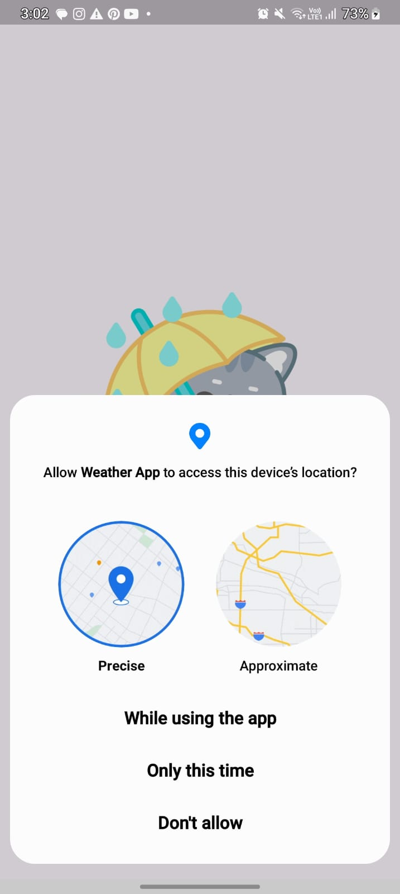
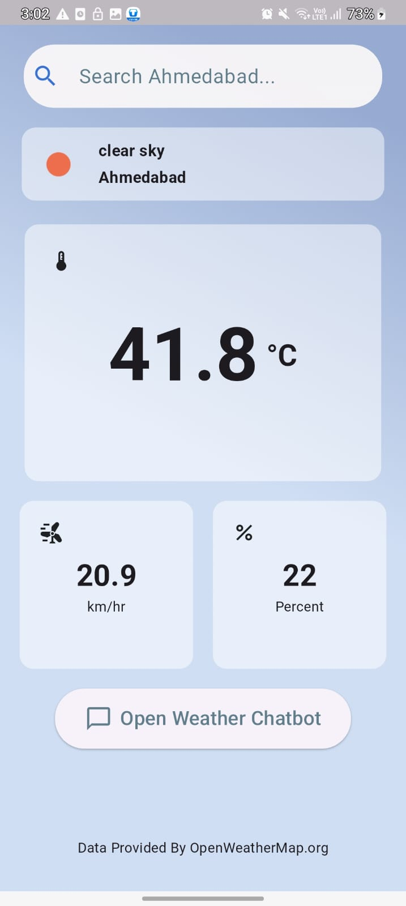
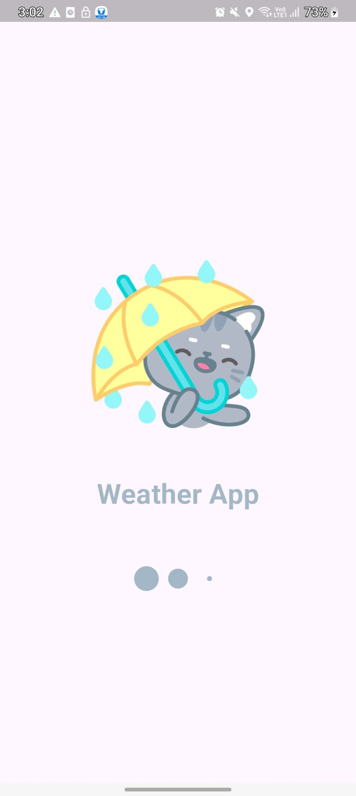
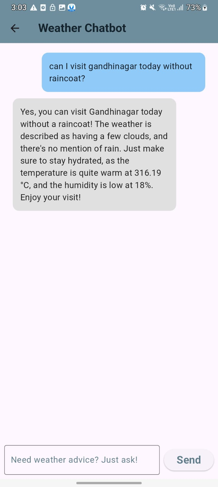

# 🌦️ MyWeatherApp

A Flutter-based weather and chatbot application that fetches real-time weather data using the OpenWeatherMap API and integrates an AI chatbot powered by OpenAI.

---

## 🚀 Features

- 🌍 Get real-time weather based on location
- 💬 Ask questions to the built-in AI-powered weather chatbot
- 🌡️ Displays temperature, humidity, air speed, and weather condition
- 🧠 Smart weather advice in natural language

---

## 🖼️ Screenshots

### Home Screen

### Weather Results

### Weather Results

### Loading Screen

### AI Chatbot

---

## 📦 Tech Stack

- **Flutter**
- **OpenWeatherMap API**
- **OpenAI GPT**
- **Dart**

---

## 📁 Setup Instructions

1. Clone this repo
2. Run `flutter pub get`
3. Add your API keys securely (do NOT hardcode)
4. Run with `flutter run`

---

## 🔐 Important

Don't forget to keep your `lib/secrets.dart` file **gitignored** to avoid exposing your API keys.

---

## 📜 License

[MIT](LICENSE)
